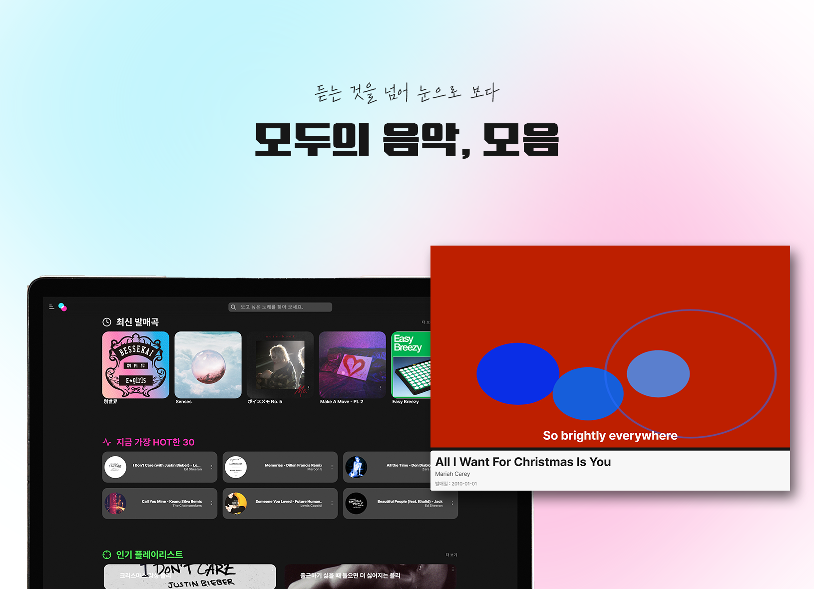

# 🥁 모두의 음악: 모음
### 청각 장애인을 위한 음악 및 가사 시각화 웹 서비스

 

## 프로젝트 소개
- **진행 기간:** 2024.10.14 ~ 2024.11.18 (5주)
- **팀 구성:** 프론트엔드 3인, 백엔드 3인 (총 6인)

 

## 모음의 기술
#### 🎨 Frontend
   

#### 🔨 Backend
    
 

#### 📊 Data Analysis & AI
    

#### 🗃 CI/CD & Server
   

#### 💻 Utility
   

 

## 담당 분야
#### 백엔드
- Music 서비스 내부 API 구현
  - 앨범 정보 및 좋아요 CRUD
  - 아티스트 정보 및 좋아요 CRUD
  - 음악 업로드 및 시각화 데이터 요청
- Recommendation 서비스 내부 API 중 재생 기록 관련 기능 구현
- Spring Boot 백엔드 서버와 FastAPI 백엔드 서버를 연결
  - 관리자가 음악을 업로드하면 시각화 데이터를 생성하는 파이프라인 구축
#### 데이터 분석 및 AI
- librosa, spotipy 패키지를 이용한 음악 분석
- OpenAI 음성 분석 AI 모델을 이용한 마디별 대표음 분석
